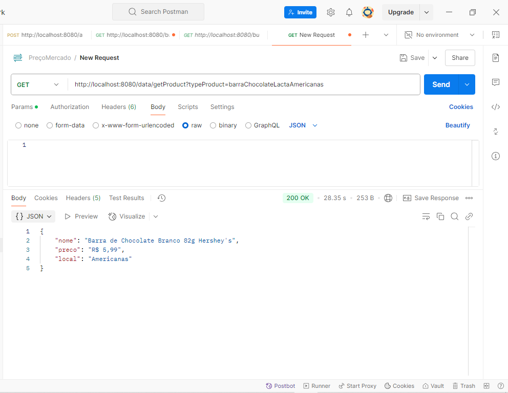
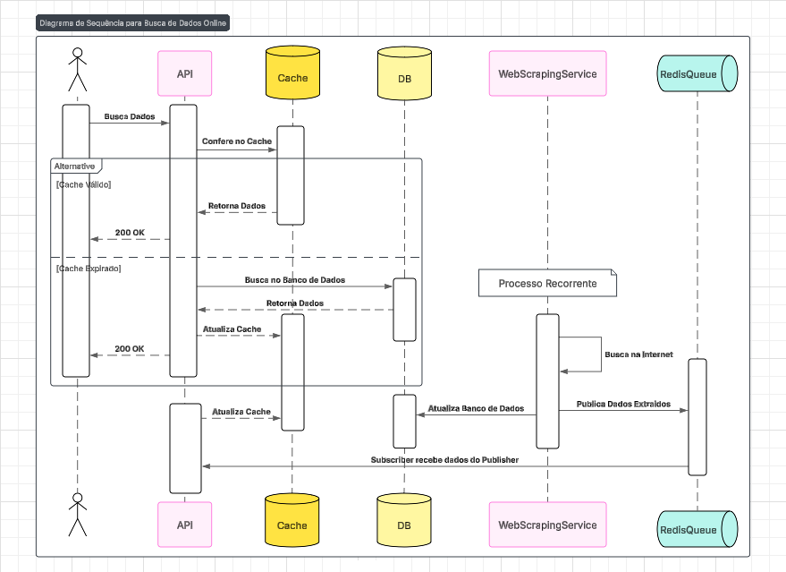
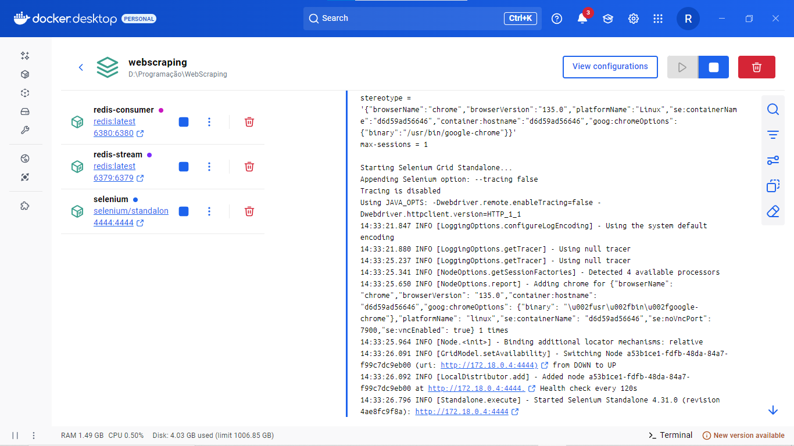

# Projeto consulta preços de produtos

## Com esse projeto você é capaz de consultar o preço dos produtos previamente antes de ir as compras

## Tecnologias Utilizadas

- **Java 17**
- **Spring Boot**
- **Maven**
- **Docker**
- **Selenium**
- **Redis Stream**
- **Docker compose**

---
## Demonstração no Postman

## Abaixo demonstro o que acontece por trás dessa API

##  e aqui os serviços utilizados

`Não aparece o banco de dados no docker porque utilizei o MongoDB Atlas`

